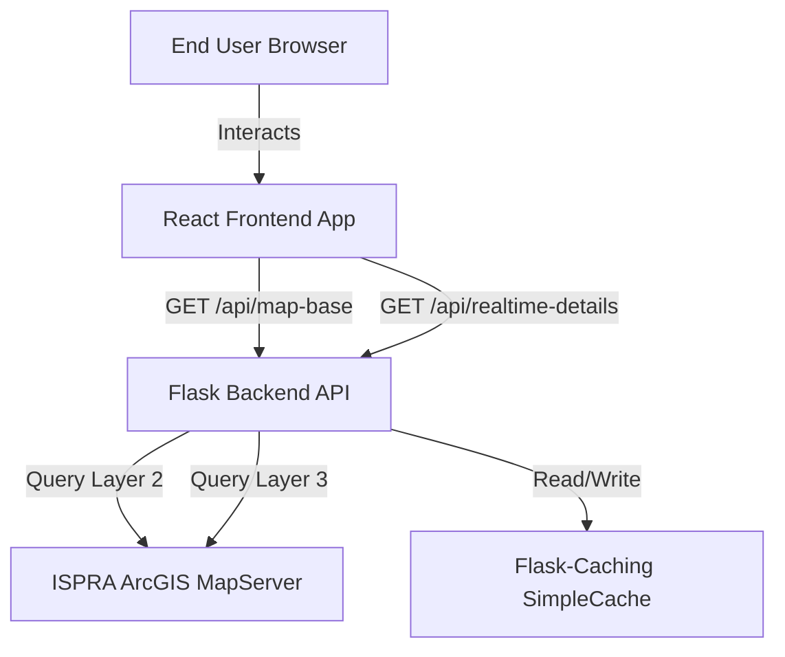
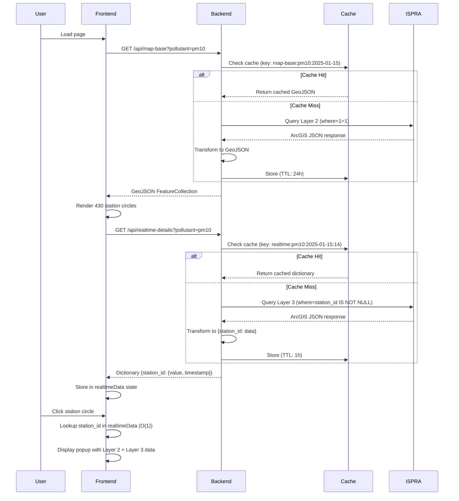

# Design Document: Hybrid Data Architecture

## Overview

This design implements a hybrid data architecture that combines ISPRA Layer 2 (daily averages for ~430 stations) with Layer 3 (hourly real-time data for ~70 active stations). The architecture prioritizes fast initial map rendering while enriching station details with the latest hourly readings through background data loading.

### Design Goals

1. **Performance**: Initial map load within 3 seconds with all 430 stations visible
2. **Data Freshness**: Display latest hourly readings when available
3. **Resilience**: Graceful degradation when Layer 3 data is unavailable
4. **Backward Compatibility**: Maintain existing visualization features (PM10/PM2.5 toggle, radius control, color coding)

### Key Design Decisions

- **Sequential Loading**: Layer 2 loads first for immediate map rendering, Layer 3 loads in background
- **Dictionary Transformation**: Layer 3 data transformed to `{station_id: data}` for O(1) popup enrichment
- **Differential Caching**: 24-hour TTL for Layer 2 (daily updates), 1-hour TTL for Layer 3 (hourly updates with 2-3 hour delay)
- **Error Isolation**: Layer 3 failures do not prevent Layer 2 visualization

## Architecture

### System Context



### Data Flow Sequence



## Components and Interfaces

### Backend Components

#### 1. Base Map Endpoint (`/api/map-base`)

**Purpose**: Provide Layer 2 daily average data for all stations in GeoJSON format

**Implementation**:
```python
@app.route('/api/map-base')
@cache.cached(timeout=86400, query_string=True)  # 24 hours
def get_map_base():
    pollutant_type = request.args.get('pollutant', 'pm10')
    
    # Construct Layer 2 URL
    base_url = get_layer_url(pollutant_type, layer=2)
    
    # Query parameters
    params = {
        'where': '1=1',
        'outFields': 'station_id,station_name,data_record_value,data_record',
        'f': 'json',
        'outSR': '4326'
    }
    
    # Fetch from ISPRA
    response = requests.get(base_url, params=params, timeout=30)
    arcgis_data = response.json()
    
    # Transform to GeoJSON
    geojson = transform_to_geojson(arcgis_data, pollutant_type)
    
    return jsonify(geojson)
```

**Response Format**:
```json
{
  "type": "FeatureCollection",
  "features": [
    {
      "type": "Feature",
      "geometry": {
        "type": "Point",
        "coordinates": [12.4964, 41.9028]
      },
      "properties": {
        "station_id": "IT1234",
        "station_name": "Roma - Via Magna Grecia",
        "value": 35.2,
        "unit": "μg/m³",
        "pollutant": "PM10",
        "date": "2025-01-14T23:59:59Z",
        "color": "yellow"
      }
    }
  ]
}
```

#### 2. Real-Time Details Endpoint (`/api/realtime-details`)

**Purpose**: Provide Layer 3 hourly data for active stations as a dictionary

**Implementation**:
```python
@app.route('/api/realtime-details')
@cache.cached(timeout=3600, query_string=True)  # 1 hour
def get_realtime_details():
    pollutant_type = request.args.get('pollutant', 'pm10')
    
    # Construct Layer 3 URL
    base_url = get_layer_url(pollutant_type, layer=3)
    
    # Query parameters
    params = {
        'where': 'station_id IS NOT NULL',
        'outFields': 'station_id,data_record_value,data_record_end_time,unit',
        'f': 'json',
        'outSR': '4326'
    }
    
    # Fetch from ISPRA
    response = requests.get(base_url, params=params, timeout=30)
    arcgis_data = response.json()
    
    # Transform to dictionary
    realtime_dict = transform_to_dictionary(arcgis_data)
    
    return jsonify(realtime_dict)
```

**Response Format**:
```json
{
  "IT1234": {
    "value": 38.5,
    "unit": "μg/m³",
    "timestamp": "2025-01-15T14:00:00Z"
  },
  "IT5678": {
    "value": 22.1,
    "unit": "μg/m³",
    "timestamp": "2025-01-15T14:00:00Z"
  }
}
```

#### 3. Cache Manager

**Purpose**: Manage caching with differential TTL strategies

**Configuration**:
```python
from flask_caching import Cache

cache = Cache(app, config={
    'CACHE_TYPE': 'SimpleCache',
    'CACHE_DEFAULT_TIMEOUT': 3600
})
```

**Cache Key Strategy**:
- Base Map: `map-base:{pollutant}:{date}` (e.g., `map-base:pm10:2025-01-15`)
- Real-Time: `realtime:{pollutant}:{date}:{hour}` (e.g., `realtime:pm10:2025-01-15:14`)

#### 4. Data Transformation Functions

**`transform_to_geojson(arcgis_data, pollutant_type)`**:
- Input: ArcGIS JSON response from Layer 2
- Output: GeoJSON FeatureCollection
- Logic:
  - Extract features array
  - For each feature, map geometry.x/y to coordinates
  - Normalize timestamp from epoch milliseconds to ISO 8601
  - Calculate color classification based on value and pollutant type
  - Build GeoJSON Feature with properties

**`transform_to_dictionary(arcgis_data)`**:
- Input: ArcGIS JSON response from Layer 3
- Output: Dictionary keyed by station_id
- Logic:
  - Extract features array
  - For each feature, use station_id as key
  - Store value, unit, and normalized timestamp
  - Return dictionary for O(1) lookup

**`get_color(value, pollutant_type)`**:
- PM10 thresholds: ≤25 (green), ≤50 (yellow), >50 (red)
- PM2.5 thresholds: ≤15 (green), ≤25 (yellow), >25 (red)
- Returns: 'green', 'yellow', 'red', or 'gray' (null values)

### Frontend Components

#### 1. App Component State Management

**State Variables**:
```javascript
const [pollutantType, setPollutantType] = useState('pm10');
const [baseMapData, setBaseMapData] = useState(null);
const [realtimeData, setRealtimeData] = useState({});
const [loading, setLoading] = useState(false);
const [error, setError] = useState(null);
const [radiusKm, setRadiusKm] = useState(10);
```

**Data Loading Logic**:
```javascript
useEffect(() => {
  const loadData = async () => {
    setLoading(true);
    setError(null);
    
    try {
      // Step 1: Fetch Layer 2 (blocking)
      const baseResponse = await axios.get(
        `${API_BASE_URL}/map-base?pollutant=${pollutantType}`
      );
      setBaseMapData(baseResponse.data);
      setLoading(false);
      
      // Step 2: Fetch Layer 3 (non-blocking)
      try {
        const realtimeResponse = await axios.get(
          `${API_BASE_URL}/realtime-details?pollutant=${pollutantType}`
        );
        setRealtimeData(realtimeResponse.data);
      } catch (realtimeError) {
        console.warn('Layer 3 data unavailable, continuing with Layer 2 only');
        setRealtimeData({});
      }
      
    } catch (err) {
      setError('Failed to load base map data');
      setLoading(false);
    }
  };
  
  loadData();
}, [pollutantType]);
```

#### 2. Enhanced Popup Component

**Purpose**: Display both daily average (Layer 2) and latest hourly reading (Layer 3)

**Implementation**:
```javascript
<Popup>
  <div className="popup-content">
    <h3>{props.station_name}</h3>
    
    {/* Layer 2: Daily Average */}
    <div className="data-section">
      <h4>Daily Average</h4>
      <p><strong>{props.pollutant}:</strong> {props.value} {props.unit}</p>
      <p><small>{new Date(props.date).toLocaleString('it-IT')}</small></p>
    </div>
    
    {/* Layer 3: Latest Hourly (if available) */}
    {realtimeData[props.station_id] && (
      <div className="data-section realtime">
        <h4>Latest Hourly</h4>
        <p><strong>{props.pollutant}:</strong> {realtimeData[props.station_id].value} {realtimeData[props.station_id].unit}</p>
        <p><small>{new Date(realtimeData[props.station_id].timestamp).toLocaleString('it-IT')}</small></p>
      </div>
    )}
    
    <p><strong>Coverage Radius:</strong> ~{radiusKm} km</p>
  </div>
</Popup>
```

**Lookup Performance**: `realtimeData[props.station_id]` is O(1) dictionary lookup in JavaScript object

#### 3. Error Handling Strategy

**Layer 2 Failure** (Critical):
- Display error message to user
- Prevent map rendering
- Show retry button

**Layer 3 Failure** (Non-Critical):
- Log warning to console
- Set `realtimeData` to empty object `{}`
- Continue with Layer 2 visualization only
- Popups display daily average without hourly data

## Data Models

### Layer 2 (Daily Average) Data Model

**Source**: ISPRA ArcGIS MapServer Layer 2

**Query**: `where=1=1` (all stations)

**Fields**:
- `station_id` (string): Unique station identifier
- `station_name` (string): Human-readable station name
- `data_record_value` (float): Daily average pollutant concentration
- `data_record` (long): Timestamp in epoch milliseconds
- `geometry.x` (float): Longitude (WGS84)
- `geometry.y` (float): Latitude (WGS84)

**Transformed GeoJSON Feature**:
```typescript
interface Layer2Feature {
  type: 'Feature';
  geometry: {
    type: 'Point';
    coordinates: [number, number]; // [lng, lat]
  };
  properties: {
    station_id: string;
    station_name: string;
    value: number;
    unit: string;
    pollutant: 'PM10' | 'PM2.5';
    date: string; // ISO 8601
    color: 'green' | 'yellow' | 'red' | 'gray';
  };
}
```

### Layer 3 (Hourly Real-Time) Data Model

**Source**: ISPRA ArcGIS MapServer Layer 3

**Query**: `where=station_id IS NOT NULL` (active stations only)

**Fields**:
- `station_id` (string): Unique station identifier
- `data_record_value` (float): Hourly pollutant concentration
- `data_record_end_time` (long): End timestamp of hourly period in epoch milliseconds
- `unit` (string): Measurement unit

**Transformed Dictionary Entry**:
```typescript
interface RealtimeDataDictionary {
  [station_id: string]: {
    value: number;
    unit: string;
    timestamp: string; // ISO 8601
  };
}
```

### Color Classification Model

**PM10 Thresholds** (based on EU air quality standards):
- Green: ≤ 25 μg/m³ (Good)
- Yellow: 26-50 μg/m³ (Moderate)
- Red: > 50 μg/m³ (Poor)

**PM2.5 Thresholds**:
- Green: ≤ 15 μg/m³ (Good)
- Yellow: 16-25 μg/m³ (Moderate)
- Red: > 25 μg/m³ (Poor)

**Gray**: Null or missing values

## Error Handling

### Backend Error Scenarios

#### 1. ISPRA Service Timeout (30 seconds)

**Detection**: `requests.exceptions.Timeout`

**Response**:
```python
try:
    response = requests.get(url, params=params, timeout=30)
except requests.exceptions.Timeout:
    return jsonify({'error': 'ISPRA service timeout'}), 504
```

#### 2. ISPRA Service Returns Malformed JSON

**Detection**: `json.JSONDecodeError`

**Response**:
```python
try:
    data = response.json()
except json.JSONDecodeError:
    return jsonify({'error': 'Invalid JSON from ISPRA service'}), 500
```

#### 3. ISPRA Service Returns Error Response

**Detection**: HTTP status code >= 400

**Response**:
```python
response.raise_for_status()  # Raises HTTPError
# Caught by exception handler
return jsonify({'error': f'ISPRA service error: {response.status_code}'}), 500
```

#### 4. Missing Required Fields in Response

**Detection**: KeyError during transformation

**Response**:
```python
try:
    station_id = feature['attributes']['station_id']
except KeyError as e:
    app.logger.error(f'Missing field in ISPRA response: {e}')
    continue  # Skip this feature, process others
```

### Frontend Error Scenarios

#### 1. Base Map Endpoint Failure

**Handling**:
```javascript
catch (err) {
  setError('Failed to load base map data. Please check backend connection.');
  setLoading(false);
  setBaseMapData(null);
}
```

**UI**: Display error message with retry button, prevent map rendering

#### 2. Real-Time Details Endpoint Failure

**Handling**:
```javascript
catch (realtimeError) {
  console.warn('Layer 3 data unavailable, continuing with Layer 2 only');
  setRealtimeData({});
}
```

**UI**: No error message to user, popups display daily data only

#### 3. Network Disconnection During Load

**Handling**: Axios timeout configuration

```javascript
const axiosInstance = axios.create({
  timeout: 10000, // 10 seconds
  baseURL: API_BASE_URL
});
```

**UI**: Display "Network error" message with retry button

## Testing Strategy

### Unit Tests

**Backend Unit Tests** (pytest):

1. **Test `transform_to_geojson`**:
   - Input: Mock ArcGIS JSON with 3 features
   - Assert: Output is valid GeoJSON FeatureCollection
   - Assert: All required properties present
   - Assert: Timestamps converted to ISO 8601

2. **Test `transform_to_dictionary`**:
   - Input: Mock ArcGIS JSON with 2 features
   - Assert: Output is dictionary with station_id keys
   - Assert: All values have required fields
   - Assert: Lookup is O(1) (implementation detail)

3. **Test `get_color` classification**:
   - PM10: value=20 → green, value=40 → yellow, value=60 → red
   - PM2.5: value=10 → green, value=20 → yellow, value=30 → red
   - Null value → gray

4. **Test cache key generation**:
   - Assert: Keys include pollutant type and date/hour
   - Assert: Different pollutants generate different keys

**Frontend Unit Tests** (Jest + React Testing Library):

1. **Test sequential data loading**:
   - Mock axios responses for both endpoints
   - Assert: Base map endpoint called first
   - Assert: Real-time endpoint called after base map resolves
   - Assert: Map renders after base map data received

2. **Test popup enrichment**:
   - Render popup with Layer 2 data only
   - Assert: Daily average section displayed
   - Assert: Hourly section not displayed
   - Update realtimeData state
   - Assert: Hourly section now displayed

3. **Test error handling**:
   - Mock base map endpoint failure
   - Assert: Error message displayed
   - Assert: Map not rendered
   - Mock realtime endpoint failure
   - Assert: No error message
   - Assert: Map still rendered

### Integration Tests

1. **Test full data flow**:
   - Start Flask backend
   - Make request to `/api/map-base?pollutant=pm10`
   - Assert: Response is valid GeoJSON
   - Assert: Response time < 2 seconds (cached)
   - Make request to `/api/realtime-details?pollutant=pm10`
   - Assert: Response is valid dictionary
   - Assert: Response time < 1 second (cached)

2. **Test cache expiration**:
   - Make request to base map endpoint
   - Assert: Cache miss (slow response)
   - Make same request within 24 hours
   - Assert: Cache hit (fast response)
   - Wait 24 hours (or clear cache)
   - Make same request
   - Assert: Cache miss (slow response)

3. **Test ISPRA service integration**:
   - Make real request to ISPRA Layer 2
   - Assert: Response contains ~430 features
   - Make real request to ISPRA Layer 3
   - Assert: Response contains ~70 features
   - Assert: All Layer 3 station_ids exist in Layer 2

### End-to-End Tests

1. **Test complete user flow**:
   - Load application
   - Assert: Map displays within 3 seconds
   - Assert: 430 circles rendered
   - Click random station circle
   - Assert: Popup displays daily average
   - Wait for Layer 3 load
   - Click station with hourly data
   - Assert: Popup displays both daily and hourly

2. **Test pollutant switching**:
   - Load application with PM10
   - Switch to PM2.5
   - Assert: Map re-renders with PM2.5 data
   - Assert: Color classifications use PM2.5 thresholds

3. **Test graceful degradation**:
   - Mock Layer 3 endpoint to return 500 error
   - Load application
   - Assert: Map still renders with Layer 2 data
   - Click station
   - Assert: Popup displays daily average only

## Backward Compatibility

### Maintaining Existing Endpoint

The existing `/api/data/{pollutant_type}` endpoint will remain functional during migration:

```python
@app.route('/api/data/<pollutant_type>')
def get_data_legacy(pollutant_type):
    """Legacy endpoint - redirects to new base map endpoint"""
    return get_map_base()
```

### Feature Parity

All existing features remain functional:
- PM10/PM2.5 toggle buttons
- Radius slider (5-25 km)
- Color-coded circles (green/yellow/red)
- Station name and value in popups
- Refresh button
- Legend display

### Migration Path

1. **Phase 1**: Deploy new endpoints alongside existing endpoint
2. **Phase 2**: Update frontend to use new endpoints
3. **Phase 3**: Monitor for issues, keep legacy endpoint active
4. **Phase 4**: Deprecate legacy endpoint after 30 days

## Performance Considerations

### Backend Optimizations

1. **Caching Strategy**:
   - Layer 2: 24-hour TTL reduces ISPRA queries to 1 per day per pollutant
   - Layer 3: 1-hour TTL balances freshness with performance
   - SimpleCache for single-server deployment (upgrade to Redis for multi-server)

2. **Request Timeout**:
   - 30-second timeout prevents indefinite hanging
   - Fail fast to allow frontend retry logic

3. **Response Size**:
   - Layer 2 GeoJSON: ~430 features × 200 bytes = ~86 KB
   - Layer 3 Dictionary: ~70 entries × 100 bytes = ~7 KB
   - Total: ~93 KB (acceptable for modern networks)

### Frontend Optimizations

1. **Sequential Loading**:
   - Layer 2 loads first (blocking) for immediate map render
   - Layer 3 loads in background (non-blocking) for progressive enhancement

2. **O(1) Lookup**:
   - Dictionary structure enables constant-time popup enrichment
   - No array iteration required (would be O(n) for 70 stations)

3. **State Management**:
   - Separate state variables prevent unnecessary re-renders
   - `baseMapData` change triggers map re-render
   - `realtimeData` change does not trigger map re-render

### Performance Targets

- **Initial Map Load**: < 3 seconds (Layer 2 fetch + render)
- **Background Layer 3 Load**: < 1 second (non-blocking)
- **Popup Enrichment**: < 500 milliseconds (O(1) lookup + render)
- **Cached Response**: < 100 milliseconds (cache hit)

## Deployment Considerations

### Environment Variables

```bash
# Backend (.env)
FLASK_ENV=production
CACHE_TYPE=SimpleCache
CACHE_DEFAULT_TIMEOUT=3600
ISPRA_TIMEOUT=30
```

### Dependencies

**Backend** (requirements.txt):
```
Flask==3.0.0
Flask-CORS==4.0.0
Flask-Caching==2.1.0
requests==2.31.0
```

**Frontend** (package.json):
```json
{
  "dependencies": {
    "react": "^18.2.0",
    "react-leaflet": "^4.2.1",
    "leaflet": "^1.9.4",
    "axios": "^1.6.0"
  }
}
```

### Monitoring

**Key Metrics**:
- Cache hit rate (target: > 95%)
- ISPRA service response time (target: < 2 seconds)
- Frontend page load time (target: < 3 seconds)
- Error rate for Layer 2 (target: < 0.1%)
- Error rate for Layer 3 (target: < 5%, non-critical)

**Logging**:
```python
app.logger.info(f'Cache hit for {cache_key}')
app.logger.warning(f'Layer 3 unavailable: {error}')
app.logger.error(f'ISPRA service error: {status_code}')
```

## Security Considerations

### Input Validation

**Pollutant Type Parameter**:
```python
ALLOWED_POLLUTANTS = ['pm10', 'pm25']

pollutant_type = request.args.get('pollutant', 'pm10')
if pollutant_type not in ALLOWED_POLLUTANTS:
    return jsonify({'error': 'Invalid pollutant type'}), 400
```

### CORS Configuration

```python
CORS(app, resources={
    r"/api/*": {
        "origins": ["http://localhost:3000", "https://yourdomain.com"],
        "methods": ["GET"],
        "allow_headers": ["Content-Type"]
    }
})
```

### Rate Limiting

Consider adding Flask-Limiter for production:
```python
from flask_limiter import Limiter

limiter = Limiter(
    app,
    key_func=lambda: request.remote_addr,
    default_limits=["100 per minute"]
)
```

## Future Enhancements

### Potential Improvements

1. **WebSocket Real-Time Updates**: Push Layer 3 updates to connected clients
2. **Redis Caching**: Upgrade from SimpleCache for multi-server deployments
3. **Historical Data**: Add endpoint for time-series data visualization
4. **Station Filtering**: Allow users to filter stations by region or value range
5. **Mobile Optimization**: Responsive design for mobile devices
6. **Offline Support**: Service worker for offline map viewing with cached data

### Scalability Considerations

- **Horizontal Scaling**: Redis cache enables multiple Flask instances
- **CDN Integration**: Serve static GeoJSON from CDN for global users
- **Database Layer**: Store historical data in PostgreSQL with PostGIS extension
- **API Gateway**: Add rate limiting and authentication at gateway level

---

**Document Version**: 1.0  
**Last Updated**: 2025-01-15  
**Status**: Ready for Implementation
